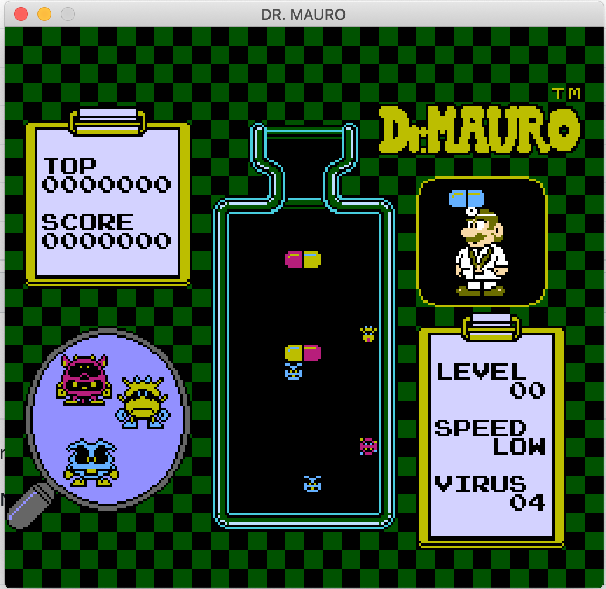

# Dr. Mauro
Assignment for C programming course (2017/2018).

Clone of the famous 1990 NES game *"Dr. Mario"*.



## Building

This project uses **CMake** for building:
```bash
git clone --recursive https://github.com/giulioz/DrMauro.git
cd DrMauro
mkdir build
cd build
cmake ..
make
```

All the dependencies are included as submodules

## Running

```bash
./DrMauro
```

## Keyboard mapping

**Player 1:** arrows and n, m for rotation

**Player 2:** wsad and 1, 2 for rotation

## Tools

Several tools are included for testing and development

- `charmapgen` is for generating font character maps
- `headerize` is for generating .h from binary files
- `imgtool` is for generating C byte arrays from images, matching with the included palette
- `boarddesigner` is useful for generating board files
